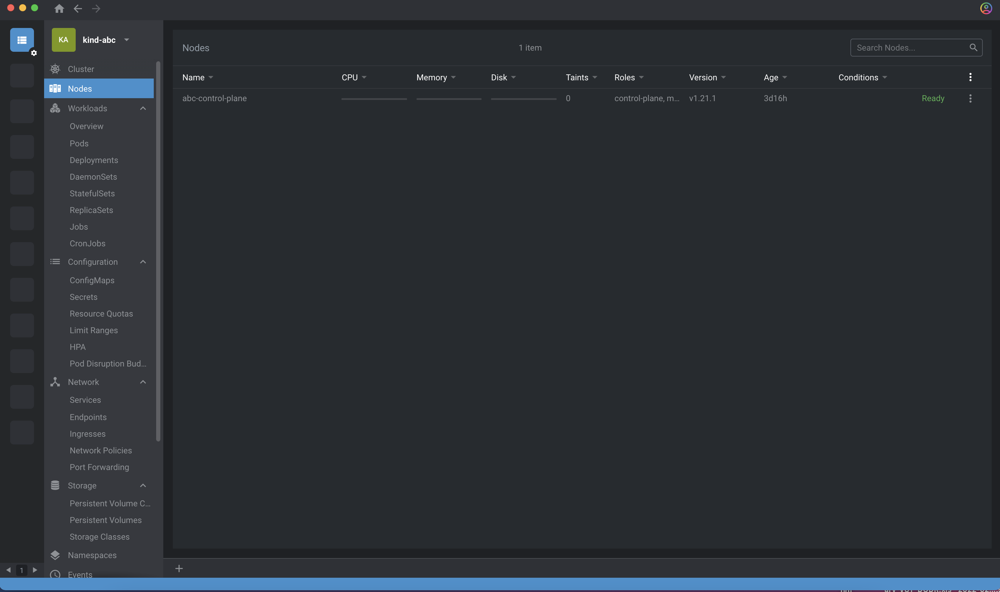

# Prerequisites

Setting up Kind Cluster, example __abc__

> _Kind Cluster usually prefix desired name with kind, so if you are creating a cluster with name __abc__ the name will be __kindabc___

## Install & Set Kind Cluster
```
$ kind create cluster --name abc

$ kubectl config use-context kind-abc
```

## Validating kind Cluster
`kind get clusters`

> Finding the node name for a given and
`kubectl get nodes -n default`

> Setting the Kind Cluster Context 
`kubectl cluster-info --context kind-abc`


## Loading The Desired images

__Kind recommends to always load docker image and Never use Always image pull  policy__
> NOTE: The Kubernetes default pull policy is IfNotPresent unless the image tag is :latest or omitted (and implicitly :latest) in which case the default policy is Always. IfNotPresent causes the Kubelet to skip pulling an image if it already exists. If you want those images loaded into node to work as expected, please:

For Lab 1, you need the following docker image locally. once the images are available locally, load the same in kind cluster named 'abc'

```
kind load docker-image --name abc gcr.io/spark-operator/spark-operator:3.1.1
kind load docker-image --name abc docker.io/apache/airflow:2.2.4
kind load docker-image --name abc docker.io/apache/airflow-statsd-exporter-2021.04.28-v0.17.0  
kind load docker-image --name abc docker.io/bitnami/postgresql:11.12.0-debian-10-r44
kind load docker-image --name abc gcr.io/spark-operator/spark-operator:3.1.1
kind load docker-image --name abc quay.io/minio/mc:RELEASE.2022-04-16T21-11-21Z  
kind load docker-image --name abc quay.io/minio/minio:RELEASE.2022-04-26T01-20-24Z
kind load docker-image --name abc pysparkexample:aws
kind load docker-image --name abc k8s.gcr.io/git-sync/git-sync:v3.4.0
```
### Verify all loaded Images

`docker exec -it abc-control-plane crictl images ps`

## Validating the Cluster using Lens

Launch lens and validate the cluster, which will show no Pods, but Nodes



# Troubleshooting

* If the cluster is not launching, check the Docker Memory/Cores 
* Port Forwarding from Lens doesnt work properly, use commandline to do the same
