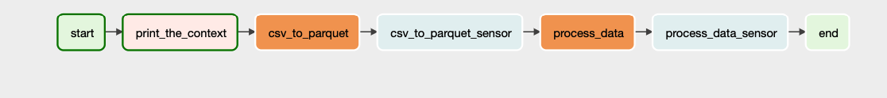
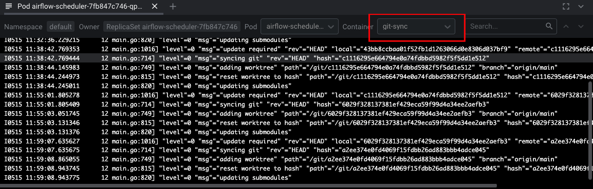
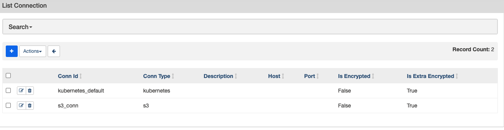

# Setting up Airflow in Kubernetes

## Create RBAC for role and services 

* Go to rbac dir and run `kubetl apply -f airflow-role.yaml`. This gives airflow access to run spark jobs and many priviledges on the default namespace
* Follow the doc for learn more about Airflow Helm, but for us, we need the following command 
```
helm repo add apache-airflow https://airflow.apache.org
helm upgrade --install airflow apache-airflow/airflow --namespace airflow --create-namespace
```
* Go to helm dir and install `helm upgrade --install airflow apache-airflow/airflow -n default -f airflow_values.yaml`
* Run the Airflow Spark Workflow `Basic_Transformation`


* Trigger the job with conf `{"source":"s3a://test-files/sample/users.csv","destination":"s3a://test-files/sample/output/users"}`
* This will generate parquet partition output in the path `s3a://test-files/sample/output/users_account/year=*/month=*/day=*`

_User can use any csv  file with a column name `account_created_at` of __date__ datatype

## Troubleshooting

* Check airflow_triggered & airflow_scheduler* pod is green or not. The usual problem is git_sync.   
In case of error, please regenerate ssh key and approve the same on your github fork/project. All Sidecar pods must be initiated correctly.

* Check for memort allocation in the airflow values.yaml file
* Make sure of creating s3_conn & kubernetes_default connection from the _airflow ui_
